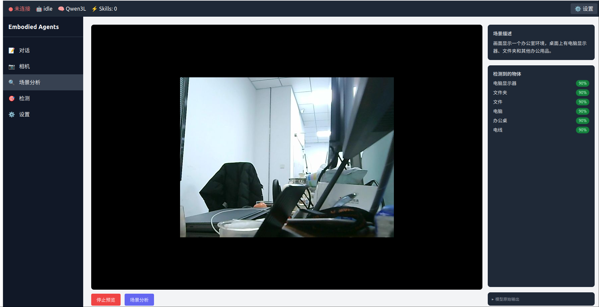
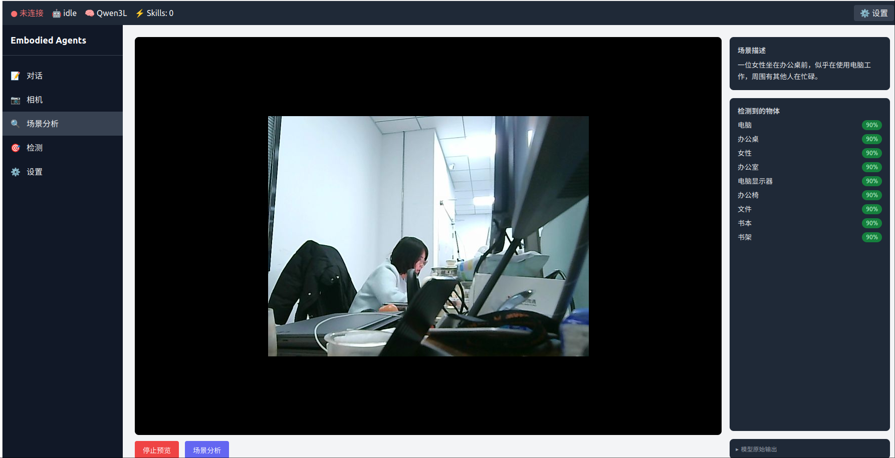

# EmbodiedAgentsSys - Agent Digital Worker Framework

<div align="center">

<picture>
  <source media="(prefers-color-scheme: dark)" srcset="docs/_static/EMBODIED_AGENTS_DARK.png">
  <source media="(prefers-color-scheme: light)" srcset="docs/_static/EMBODIED_AGENTS_LIGHT.png">
  
</picture>

<br/>

[](https://opensource.org/licenses/MIT)
[](https://www.python.org/downloads/)
[](https://docs.ros.org/en/humble/index.html)

**General Embodied Intelligence Robot Framework - VLA Model Supported Agent Digital Worker System**

[**Installation**](#installation) | [**Quick Start**](#quick-start) | [**Features**](#features) | [**Guides**](#guides)

</div>

---

## Overview

**EmbodiedAgentsSys** is a ROS2-based general-purpose embodied intelligence robot framework, supporting VLA (Vision-Language-Action) model based Agent digital worker systems.

### Core Features

- **VLA Multi-Model Support**
  - Adapters for LeRobot, ACT, GR00T and other VLA models
  - Unified VLA interface design for easy extension

- **Rich Skills Library**
  - Atomic skills: grasp, place, reach, joint motion, inspect
  - Skill chain orchestration and task planning support

- **Event-Driven Architecture**
  - Asynchronous non-blocking execution
  - Event bus for loose-coupled component communication

- **Task Planning Capabilities**
  - Rule-based task planning
  - LLM-driven intelligent task decomposition

- **Core Execution Loop (Phase 1)**
  - Hardware abstraction layer: unified arm interface + multi-vendor adapters
  - Skills registry + capability gap detection (YAML-driven)
  - Scene specification + voice interaction filling
  - Dual-format execution plans (YAML machine-readable + Markdown human-readable)
  - Automatic failure data recording + training script auto-generation

---

## Features

### VLA Adapters

| Adapter | Description | Status |
|---------|-------------|--------|
| VLAAdapterBase | VLA adapter base class | ✅ |
| LeRobotVLAAdapter | LeRobot framework adapter | ✅ |
| ACTVLAAdapter | ACT (Action Chunking Transformer) adapter | ✅ |
| GR00TVLAAdapter | GR00T Diffusion Transformer adapter | ✅ |

### Skills

| Skill | Description | Status |
|-------|-------------|--------|
| GraspSkill | Grasp skill | ✅ |
| PlaceSkill | Place skill | ✅ |
| ReachSkill | Reach skill | ✅ |
| MoveSkill | Joint motion skill | ✅ |
| InspectSkill | Inspect/recognize skill | ✅ |
| AssemblySkill | Assembly skill | ✅ |
| Perception3DSkill | 3D perception skill | ✅ |

### Components

| Component | Description | Status |
|-----------|-------------|--------|
| VoiceCommand | Voice command understanding | ✅ |
| SemanticParser | Semantic parser (LLM enhanced) | ✅ |
| TaskPlanner | Task planner (with execution memory) | ✅ |
| EventBus | Event bus | ✅ |
| DistributedEventBus | Distributed event bus | ✅ |
| SkillGenerator | Skill code generator | ✅ |
| CoTTaskPlanner | 5-step CoT reasoning planner (Paper §3.1) | ✅ |
| SubtaskMonitor | Deployment-time process supervision (Paper §3.3) | ✅ |
| ConversationalSceneAgent | LLM-driven conversational SceneSpec filling | ✅ |

### Tools

| Tool | Description | Status |
|------|-------------|--------|
| AsyncCache | Async cache | ✅ |
| BatchProcessor | Batch processor | ✅ |
| RateLimiter | Rate limiter | ✅ |
| ForceController | Force controller | ✅ |

### Hardware Abstraction Layer (Phase 1)

| Module | Description | Status |
|--------|-------------|--------|
| ArmAdapter | Arm abstraction base class (ABC), defines unified interfaces like `move_to_pose` / `move_joints` / `set_gripper` | ✅ |
| AGXArmAdapter | AGX arm adapter (async, supports mock mode) | ✅ |
| LeRobotArmAdapter | LeRobot arm adapter (reuses LeRobotClient) | ✅ |
| RobotCapabilityRegistry | YAML-driven skills registry, supports querying capabilities by `robot_type`, returns `GapType` enum | ✅ |
| GapDetectionEngine | Classifies execution plan steps with hard-gap annotations, outputs `GapReport` | ✅ |
| HardwareScanner | Auto-scan serial ports and cameras, register to capability registry | ✅ |

### Planning Layer Extensions (Phase 1)

| Module | Description | Status |
|--------|-------------|--------|
| SceneSpec | Structured scene description dataclass, supports YAML serialization/deserialization | ✅ |
| PlanGenerator | Wraps TaskPlanner, maps flat actions to dot-notation skill names, outputs YAML + Markdown dual-format execution plans | ✅ |
| VoiceTemplateAgent | Guided voice Q&A, progressively fills SceneSpec fields | ✅ |

### Data & Training (Phase 1)

| Module | Description | Status |
|--------|-------------|--------|
| FailureDataRecorder | Auto-saves `metadata.json` + `scene_spec.yaml` + `plan.yaml` on failure | ✅ |
| TrainingScriptGenerator | Generates dataset requirements report and bash training scripts based on capability gaps | ✅ |
| EAPOrchestrator | Autonomous data collection via Entangled Action Pairs (Paper §3.2) | ✅ |
| TrajectoryRecorder | Saves EAP + deployment trajectories to LeRobot-compatible dataset format | ✅ |

---

## RoboClaw Integration (Paper Implementation)

> Based on [*RoboClaw: An Agentic Framework for Scalable Long-Horizon Robotic Tasks*](https://arxiv.org/abs/2506.00000)

### LLM Multi-Provider (Phase A)

```python
from agents.llm.provider import LLMProvider, GenerationSettings
from agents.llm.ollama_provider import OllamaProvider
from agents.llm.litellm_provider import LiteLLMProvider

# Ollama (local)
provider = OllamaProvider(model="qwen2.5:3b", host="http://localhost:11434")

# Cloud LLM (Claude / GPT / Gemini) via LiteLLM
provider = LiteLLMProvider(model="claude-3-5-haiku-20241022")

# Inject into TaskPlanner
from agents.components.task_planner import TaskPlanner
planner = TaskPlanner(llm_provider=provider)
```

Configure via `config/llm_config.yaml`:
```yaml
provider: ollama        # ollama | litellm
model: qwen2.5:3b
```

### Structured Robot Memory (Phase B)

Paper §3.1: `m_t = (r_t, g_t, w_t)` — Role Identity, Task Graph, Working Memory.

```python
from agents.memory.robot_memory import RobotMemoryState

memory = RobotMemoryState.create_for_task(
    global_task="Pick red cup and place on shelf",
    subtask_descriptions=["navigate to table", "grasp cup", "navigate to shelf", "place cup"],
    robot_type="mobile_arm",
)

# Inject memory into TaskPlanner for context-aware planning
planner = TaskPlanner(llm_provider=provider, robot_memory=memory)
```

### CoT 5-Step Reasoning Planner (Phase B)

```python
from agents.components.cot_planner import CoTTaskPlanner

planner = CoTTaskPlanner(provider=provider)
decision = await planner.decide_next_action(
    memory=memory,
    observation="Red cup detected at position [0.3, 0.1, 0.5]",
)
print(decision.skill_id)       # e.g. "manipulation.grasp"
print(decision.task_state)     # PROGRESSING | SATISFIED | STUCK
```

### Multi-Platform Messaging Channels (Phase C)

AgentLoop integrates with Telegram, Feishu (Lark) and CLI channels.

```python
from agents.channels.bus import MessageBus
from agents.channels.agent_loop import AgentLoop
from agents.channels.telegram_channel import TelegramChannel

bus = MessageBus()

# Optional: Telegram channel (requires python-telegram-bot>=21.0)
channel = TelegramChannel(bus, token="YOUR_BOT_TOKEN", allow_from=["123456789"])
await channel.start()

# EventBus → MessageBus bridge for HIGH/CRITICAL events
from agents.events.bus import EventBus
event_bus = EventBus()
event_bus.set_outbound_bridge(bus, chat_id="123456789", channel="telegram")
```

Configure via `config/channels_config.yaml`.

### EAP Autonomous Data Collection (Phase D)

Paper §3.2: Self-Resetting Data Collection via Entangled Action Pairs — reduces human interventions by **8.04×**.

```python
from agents.data.eap import EAPPair, EAPPolicy
from agents.data.eap_orchestrator import EAPOrchestrator

pair = EAPPair(
    task_name="pick_and_place",
    forward=EAPPolicy("fwd-1", "forward", "manipulation.grasp", "Grasp the {object}", "Object is grasped"),
    reverse=EAPPolicy("rev-1", "reverse", "manipulation.place_back", "Place back {object}", "Object returned"),
)

orchestrator = EAPOrchestrator(pair=pair, cot_planner=planner, skill_registry=registry, bus=bus, memory=memory)
trajectories = await orchestrator.run_collection_loop(target_trajectories=50)
```

### Deployment-Time Process Supervision (Phase E)

Paper §3.3: Continuous monitoring during skill execution — improves long-horizon task success by **25%**.

```python
from agents.components.subtask_monitor import SubtaskMonitor

monitor = SubtaskMonitor(
    cot_planner=planner,
    memory=memory,
    check_interval_sec=2.0,
    stuck_threshold=3,     # switch policy after 3 consecutive stuck evaluations
)

result = await monitor.monitor_subtask(subtask, skill_execution_coro)
# result.outcome: "success" | "failed" | "stuck" | "switched"
```

### Skill Format with EAP Metadata (Phase F)

```yaml
---
name: manipulation.grasp
description: "Grasp specified object"
requires:
  bins: ["lerobot"]
  env: ["LEROBOT_HOST"]
always: false
metadata:
  eap:
    has_reverse: true
    reverse_skill: "manipulation.reverse_grasp"
---
```

Check availability programmatically:
```python
from agents.skills.md_skill_adapter import MDSkillManager

manager = MDSkillManager(skills_dir="skills/")
available, missing = manager.check_availability("manipulation.grasp")
# available: False, missing: ["bin:lerobot", "env:LEROBOT_HOST"]
```

See [docs/skill_format.md](docs/skill_format.md) for full spec.

### Conversational Onboarding (Phase G)

```python
from agents.components.voice_template_agent import ConversationalSceneAgent

agent = ConversationalSceneAgent(llm_provider=provider)

# Fill SceneSpec from a single natural-language utterance
spec = await agent.fill_from_utterance(
    utterance="抓取桌上的红色杯子",
    send_fn=your_send_function,
    recv_fn=your_receive_function,
)
print(spec.scene_type)        # "pick"
print(spec.is_complete())     # True after follow-up questions

# Auto-scan hardware
from agents.hardware.scanner import HardwareScanner
scanner = HardwareScanner()
result = await scanner.scan_and_register(registry, config_path=Path("config/setup.json"))
```

---

## Installation

### 1. Install ROS2 Humble

```bash
sudo apt install ros-humble-desktop
```

### 2. Install Sugarcoat Dependencies

```bash
sudo apt install ros-humble-automatika-ros-sugar
```

Or build from source:

```bash
git clone https://github.com/automatika-robotics/sugarcoat
cd sugarcoat
pip install -e .
```

### 3. Install EmbodiedAgentsSys

```bash
pip install -e .
```

Optional dependencies for RoboClaw integration features:

```bash
# Cloud LLM providers (Claude, GPT, Gemini)
pip install -e ".[llm]"

# Telegram + Feishu messaging channels
pip install -e ".[channels]"

# All optional dependencies
pip install -e ".[all]"
```

---

## Quick Start

### Create VLA Adapter

```python
from agents.clients.vla_adapters import LeRobotVLAAdapter

# Create LeRobot adapter
adapter = LeRobotVLAAdapter(config={
    "policy_name": "panda_policy",
    "checkpoint": "lerobot/act_...",
    "host": "127.0.0.1",
    "port": 8080,
    "action_dim": 7
})

adapter.reset()
```

### Create and Execute Skill

```python
import asyncio
from agents.skills.manipulation import GraspSkill

# Create grasp skill
skill = GraspSkill(
    object_name="cube",
    vla_adapter=adapter
)

# Prepare observation data
observation = {
    "object_detected": True,
    "grasp_success": False
}

# Execute skill
result = asyncio.run(skill.execute(observation))

print(f"Status: {result.status}")
print(f"Output: {result.output}")
```

---

## Guides

### 1. VLA Adapter Usage

#### LeRobot Adapter

```python
from agents.clients.vla_adapters import LeRobotVLAAdapter

adapter = LeRobotVLAAdapter(config={
    "policy_name": "panda_policy",
    "checkpoint": "lerobot/act_sim_transfer_cube_human",
    "host": "127.0.0.1",
    "port": 8080,
    "action_dim": 7
})

adapter.reset()

# Generate action
observation = {
    "image": image_data,
    "joint_positions": joints
}
action = adapter.act(observation, "grasp(object=cube)")

# Execute action
result = adapter.execute(action)
```

#### ACT Adapter

```python
from agents.clients.vla_adapters import ACTVLAAdapter

adapter = ACTVLAAdapter(config={
    "model_path": "/models/act",
    "chunk_size": 100,
    "horizon": 1,
    "action_dim": 7
})
```

#### GR00T Adapter

```python
from agents.clients.vla_adapters import GR00TVLAAdapter

adapter = GR00TVLAAdapter(config={
    "model_path": "/models/gr00t",
    "inference_steps": 10,
    "action_dim": 7,
    "action_horizon": 8
})
```

### 2. Skills Usage

#### GraspSkill - Grasp

```python
from agents.skills.manipulation import GraspSkill

skill = GraspSkill(
    object_name="cube",
    vla_adapter=adapter
)

# Check preconditions
observation = {"object_detected": True}
if skill.check_preconditions(observation):
    result = asyncio.run(skill.execute(observation))
```

#### PlaceSkill - Place

```python
from agents.skills.manipulation import PlaceSkill

skill = PlaceSkill(
    target_position=[0.5, 0.0, 0.1],  # x, y, z
    vla_adapter=adapter
)
```

#### ReachSkill - Reach

```python
from agents.skills.manipulation import ReachSkill

skill = ReachSkill(
    target_position=[0.3, 0.0, 0.2],
    vla_adapter=adapter
)
```

#### MoveSkill - Joint Motion

```python
from agents.skills.manipulation import MoveSkill

# Joint mode
skill = MoveSkill(
    target_joints=[0.0, 0.0, 0.0, 0.0, 0.0, 0.0, 0.0],
    vla_adapter=adapter
)

# End-effector pose mode
skill = MoveSkill(
    target_pose=[0.3, 0.0, 0.2, 0.0, 0.0, 0.0],  # x, y, z, roll, pitch, yaw
    vla_adapter=adapter
)
```

#### InspectSkill - Inspect

```python
from agents.skills.manipulation import InspectSkill

skill = InspectSkill(
    target_object="cup",
    inspection_type="detect",  # detect/verify/quality
    vla_adapter=adapter
)
```

### 3. Skill Chain Execution

```python
import asyncio
from agents.skills.manipulation import ReachSkill, GraspSkill, PlaceSkill

async def pick_and_place():
    adapter = LeRobotVLAAdapter(config={"action_dim": 7})

    # Create skill chain
    reach = ReachSkill(target_position=[0.3, 0.0, 0.2], vla_adapter=adapter)
    grasp = GraspSkill(object_name="cube", vla_adapter=adapter)
    place = PlaceSkill(target_position=[0.5, 0.0, 0.1], vla_adapter=adapter)

    # Execute in sequence
    observation = await get_observation()

    await reach.execute(observation)
    await grasp.execute(observation)
    await place.execute(observation)

asyncio.run(pick_and_place())
```

### 4. Event Bus Usage

```python
from agents.events.bus import EventBus, Event

bus = EventBus()

async def on_skill_started(event: Event):
    print(f"Skill started: {event.data}")

# Subscribe to event
bus.subscribe("skill.started", on_skill_started)

# Publish event
await bus.publish(Event(
    type="skill.started",
    source="agent",
    data={"skill": "grasp", "object": "cube"}
))
```

### 5. Task Planner Usage

```python
from agents.components.task_planner import TaskPlanner, PlanningStrategy

# Create planner (rule-based)
planner = TaskPlanner(strategy=PlanningStrategy.RULE_BASED)

# Plan task
task = planner.plan("Grasp the cup and place it on the table")

print(f"Task: {task.name}")
print(f"Skills: {task.skills}")
# Output: ['reach', 'grasp', 'reach', 'place']
```

### 6. Semantic Parser Usage

```python
from agents.components.semantic_parser import SemanticParser

# Use LLM enhanced parsing
parser = SemanticParser(use_llm=True, ollama_model="qwen2.5:3b")

# Sync parsing (rule mode)
result = parser.parse("forward 20cm")
# {'intent': 'motion', 'direction': 'forward', 'distance': 0.2}

# Async parsing (LLM mode)
result = await parser.parse_async("move that round part over there")
# {'intent': 'motion', 'params': {'direction': 'forward', ...}}
```

### 7. Force Control Module Usage

```python
from skills.force_control import ForceController, ForceControlMode

controller = ForceController(
    max_force=10.0,
    contact_threshold=0.5
)

# Set force control mode
controller.set_mode(ForceControlMode.FORCE)

# Apply force
target_force = np.array([0.0, 0.0, -5.0])
result = await controller.execute(target_force)
```

### 8. Performance Optimization Tools

#### Async Cache

```python
from agents.utils.performance import AsyncCache, get_cache

cache = get_cache(ttl_seconds=60)

@cache.cached
async def expensive_operation(data):
    # Time-consuming operation
    return result
```

#### Batch Processor

```python
from agents.utils.performance import BatchProcessor

processor = BatchProcessor(batch_size=10, timeout=0.1)

async def handler(items):
    # Batch processing
    return [process(item) for item in items]

# Start processing
asyncio.create_task(processor.process(handler))

# Add task
result = await processor.add(item)
```

### 9. SkillGenerator Usage

```python
from skills.teaching.skill_generator import SkillGenerator

generator = SkillGenerator(output_dir="./generated_skills", _simulated=False)

# Generate Skill from teaching action
teaching_action = {
    "action_id": "demo_001",
    "name": "pick_and_place",
    "frames": [
        {"joint_positions": [0.0, 0.0, 0.0, 0.0, 0.0, 0.0, 0.0]},
        {"joint_positions": [0.5, 0.2, 0.1, 0.0, 0.0, 0.0, 0.0]},
    ]
}

result = await generator.generate_skill(
    teaching_action=teaching_action,
    skill_name="demo_pick_place"
)

# Export to file
export_result = await generator.export_skill(result["skill_id"])
# Generates executable Python file
```

### 10. Phase 1 Core Execution Loop

#### Scene Description + Voice Interaction Filling

```python
import asyncio
from agents.components.scene_spec import SceneSpec
from agents.components.voice_template_agent import VoiceTemplateAgent

# Method 1: Direct SceneSpec construction
scene = SceneSpec(
    task_description="Move red part from area A to area B",
    robot_type="arm",
    objects=["red_part"],
    target_positions={"red_part": [0.5, 0.2, 0.1]},
)

# Method 2: Guided voice interaction filling
agent = VoiceTemplateAgent()
scene = asyncio.run(agent.interactive_fill())
```

#### Generate Execution Plan (YAML + Markdown Dual Format)

```python
from agents.components.plan_generator import PlanGenerator

generator = PlanGenerator(backend="mock")  # backend="ollama" uses LLM
plan = asyncio.run(generator.generate(scene))

print(plan.yaml_content)    # YAML execution plan (machine readable)
print(plan.markdown_report) # Markdown report (human readable)
print(plan.steps)           # Step list, each with dot-notation skill name
# e.g. [{'action': 'manipulation.grasp', 'object': 'red_part', ...}]
```

#### Skills Registry + Capability Gap Detection

```python
from agents.hardware.capability_registry import RobotCapabilityRegistry, GapType
from agents.hardware.gap_detector import GapDetectionEngine

registry = RobotCapabilityRegistry()

# Query single skill
result = registry.query("manipulation.grasp", robot_type="arm")
print(result.gap_type)  # GapType.NONE - supported

result = registry.query("navigation.goto", robot_type="arm")
print(result.gap_type)  # GapType.HARD - not supported

# Batch detect gaps for plan steps
engine = GapDetectionEngine(registry)
report = engine.detect(plan.steps, robot_type="arm")
print(report.has_gaps)        # True/False
print(report.gap_steps)       # List of steps with gaps
annotated = engine.annotate_steps(plan.steps, robot_type="arm")
# Each step gets new status: "pending" or "gap"
```

#### Failure Data Recording + Training Script Generation

```python
from agents.data.failure_recorder import FailureDataRecorder
from agents.training.script_generator import TrainingScriptGenerator

# Save scene data on execution failure
recorder = FailureDataRecorder(base_dir="./failure_data")
record_path = asyncio.run(recorder.record(
    scene=scene,
    plan=plan,
    error="manipulation.grasp execution timeout",
))
# Saves: failure_data/<timestamp>/metadata.json + scene_spec.yaml + plan.yaml

# Generate training script based on capability gaps
generator = TrainingScriptGenerator()
config = generator.generate_config(gap_report=report, scene=scene)
script = generator.generate_script(config)
print(script)  # bash training script content
req_report = generator.generate_requirements_report(config)
print(req_report)  # Dataset requirements report (Markdown)
```

#### Using Arm Adapter

```python
from agents.hardware.agx_arm_adapter import AGXArmAdapter
from agents.hardware.arm_adapter import Pose6D

# Create adapter (mock=True for testing, no real hardware needed)
arm = AGXArmAdapter(host="192.168.1.100", mock=True)
asyncio.run(arm.connect())

# Check ready
ready = asyncio.run(arm.is_ready())

# Move to target pose
pose = Pose6D(x=0.3, y=0.0, z=0.2, roll=0.0, pitch=0.0, yaw=0.0)
success = asyncio.run(arm.move_to_pose(pose, speed=0.1))

# Control gripper
asyncio.run(arm.set_gripper(opening=0.8, force=5.0))

# Query capabilities
caps = arm.get_capabilities()
print(caps.robot_type)   # "arm"
print(caps.skill_ids)    # ["manipulation.grasp", "manipulation.place", ...]
```

### 11. Distributed Event Bus (Multi-Robot Collaboration)

```python
from agents.events.bus import DistributedEventBus

# Create distributed event bus (requires ROS2 node)
bus = DistributedEventBus(ros_node=my_ros_node, namespace="/robots/events")

# Subscribe to event
async def on_robot_status(event):
    print(f"Robot status: {event.data}")

bus.subscribe("robot.status", on_robot_status)

# Publish event (automatically broadcast to other ROS2 nodes)
await bus.publish(Event(
    type="robot.status",
    source="robot_1",
    data={"status": "working", "battery": 85}
))
```

---

## Models

Some models are not included in the repository due to size constraints. Download them separately:

### Qwen3.5 Claude Distilled (GGUF)

```bash
# Option 1: Download from Hugging Face
# Visit: https://huggingface.co/<model-path>
# Download qwen3.5-9b-claude-distilled-v2-gguf/

# Option 2: Using huggingface-cli
huggingface-cli download <model-path> --local models/qwen3.5-9b-claude-distilled-v2-gguf

# Option 3: Manual download
# Place downloaded files into: models/qwen3.5-9b-claude-distilled-v2-gguf/
```

**Note:** The `models/` directory is in `.gitignore` and should not be committed to git.

---

## Configuration Files

### VLA Configuration (config/vla_config.yaml)

```yaml
lerobot:
  policy_name: "default_policy"
  checkpoint: null
  host: "127.0.0.1"
  port: 8080
  action_dim: 7

vla_type: "lerobot"

skills:
  max_retries: 3
  observation_timeout: 5.0
```

---

## Project Structure

```
agents/
├── clients/
│   ├── vla_adapters/          # VLA adapters
│   │   ├── base.py
│   │   ├── lerobot.py
│   │   ├── act.py
│   │   └── gr00t.py
│   └── ollama.py              # Ollama LLM client
├── components/                # Components
│   ├── voice_command.py
│   ├── semantic_parser.py
│   ├── task_planner.py        # Contains _SKILL_NAMESPACE_MAP
│   ├── scene_spec.py          # [Phase 1] Scene specification dataclass
│   ├── plan_generator.py      # [Phase 1] Dual-format execution plan generator
│   └── voice_template_agent.py# [Phase 1] Guided voice interaction filling
├── hardware/                  # [Phase 1] Hardware abstraction layer
│   ├── arm_adapter.py         # ArmAdapter ABC + Pose6D / RobotState / RobotCapabilities
│   ├── agx_arm_adapter.py     # AGX arm adapter
│   ├── lerobot_arm_adapter.py # LeRobot arm adapter
│   ├── capability_registry.py # RobotCapabilityRegistry + GapType enum
│   ├── gap_detector.py        # GapDetectionEngine
│   └── skills_registry.yaml   # Skills registry (9 skills)
├── data/                      # [Phase 1] Data layer
│   └── failure_recorder.py    # Automatic failure data recording
├── training/                  # [Phase 1] Training layer
│   └── script_generator.py    # Training script + dataset requirements report generation
├── skills/
│   ├── vla_skill.py           # Skill base class
│   └── manipulation/          # Manipulation skills
│       ├── grasp.py
│       ├── place.py
│       ├── reach.py
│       ├── move.py
│       └── inspect.py
├── events/                    # Event system
│   └── bus.py                 # EventBus + DistributedEventBus
└── utils/                     # Utilities
    └── performance.py

skills/
├── force_control/             # Force control module
│   └── force_control.py
├── vision/                    # Vision skills
│   └── perception_3d_skill.py
└── teaching/                  # Teaching module
    └── skill_generator.py

tests/                         # Tests (57 test cases)
docs/
├── api/                       # API documentation
├── guides/                    # Usage guides
└── plans/                     # Development plans
```

---

## Web Frontend Dashboard

The Agent Dashboard provides real-time camera preview, scene description and object detection capabilities. Built with React + FastAPI, using local Ollama `qwen2.5vl` vision model for inference.

### Demo Preview

<div align="center">

<p><em>Scene Analysis Panel: Real-time preview + qwen2.5vl scene description + object detection confidence</em></p>


<p><em>Detection Results: Automatically identifies monitor, folder, computer and other objects on office desk</em></p>
</div>

### Prerequisites

- USB camera connected (default `/dev/video0`)
- Ollama installed with vision model pulled:
  ```bash
  ollama pull qwen2.5vl
  ```
- Python dependencies:
  ```bash
  pip install fastapi uvicorn opencv-python ollama
  ```
- Node.js dependencies (first run):
  ```bash
  cd web-dashboard && npm install
  ```

### How to Start

**Terminal 1 — Backend** (USB camera + qwen2.5vl inference):

```bash
cd /path/to/EmbodiedAgentsSys
python examples/agent_dashboard_backend.py
# Backend runs on http://localhost:8000
```

**Terminal 2 — Frontend** (React dev server):

```bash
cd web-dashboard
npx vite
# Frontend runs on http://localhost:5173
```

Open browser at `http://localhost:5173`

### Feature Pages

| Sidebar | Feature |
|---------|---------|
| **Camera** | Real-time camera preview (~10 fps), start/stop buttons |
| **Scene Analysis** | Real-time preview + click "Scene Analysis" to call qwen2.5vl, returns scene description and object list |
| **Detection** | Table showing detected objects and confidence scores |
| **Chat** | Text interaction with backend Agent |

### API Endpoints

Backend provides the following REST endpoints (port 8000):

| Method | Path | Description |
|--------|------|-------------|
| GET | `/api/camera/frame` | Get current frame (base64 JPEG) |
| POST | `/api/scene/describe` | Trigger qwen2.5vl scene understanding, returns description and object list |
| GET | `/api/detection/result` | Get latest object detection results |
| GET | `/healthz` | Health check |

---

## Related Documentation

- [VLA Adapter API](docs/api/vla_adapter.md)
- [Skills API](docs/api/skills.md)
- [Getting Started Guide](docs/guides/getting_started.md)
- [Integration Plan](docs/integration_plan_v1.0_20260303_AI.md)

---

## License

MIT License - Copyright (c) 2024-2026

---

## Contact

- GitHub: https://github.com/hzm8341/EmbodiedAgentsSys
- Documentation: https://automatika-robotics.github.io/embodied-agents/
